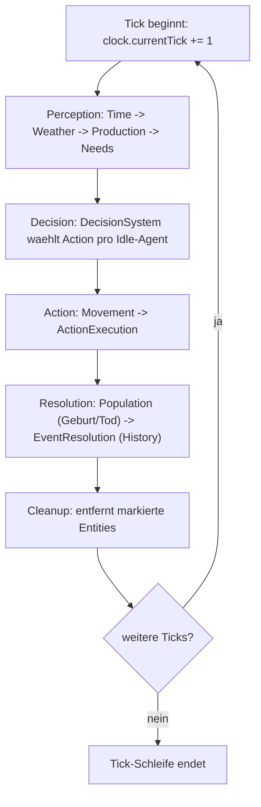
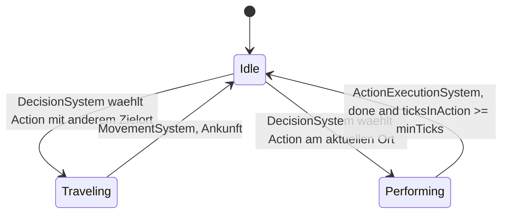
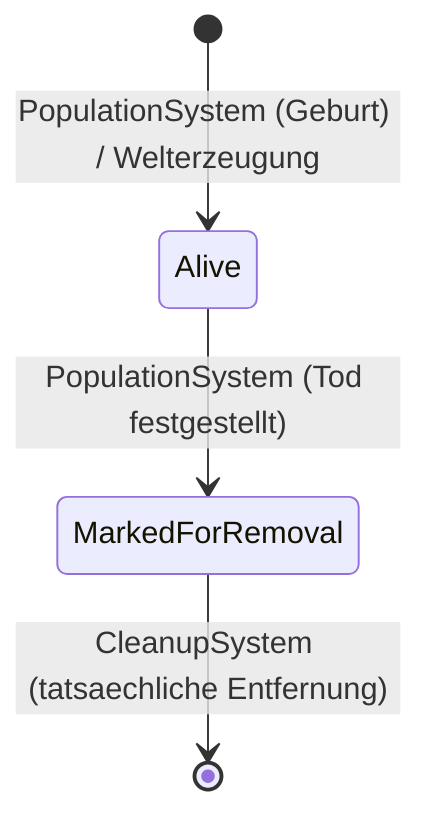
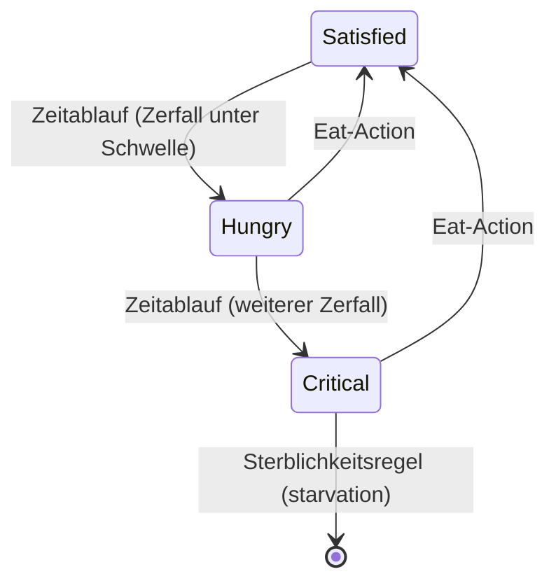
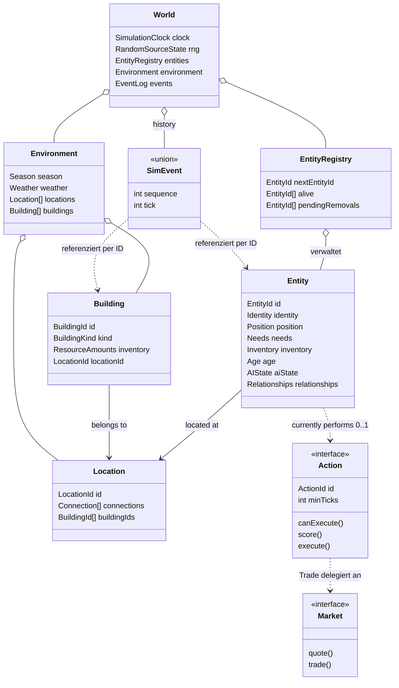

# Subtask 3 — Domänenmodell, Interfaces und Simulationsregeln

> Status: Fachliche/technische Konkretisierung abgeschlossen. **Kein produktiver Code.**
> Baut verbindlich auf [01-recherche-konzeption.md](./01-recherche-konzeption.md) und [02-architektur.md](./02-architektur.md) auf.
> Interface-/Typskizzen sind konzeptionelles Pseudocode, keine Implementierung.

Legende: **Erkenntnis** · **Annahme** · **Offen** · **Korrektur** (löst einen Widerspruch zwischen Subtask 1 und 2 explizit auf).

---

## 1. Ausgangslage

Subtask 1 hat Anforderungen und Architekturempfehlungen erarbeitet, Subtask 2 hat daraus eine konkrete Architektur (Sprache, Schichten, ECS-lite, zehn Systeme, RNG, Persistenz, CLI) abgeleitet und als **Architecture Baseline** fixiert. Diese Baseline wird hier **nicht neu erfunden**. Dieser Subtask arbeitet eine Ebene tiefer: er formalisiert das **Domänenmodell** selbst — Identitäten, Zustände, Beziehungen, Invarianten, Interfaces aus fachlicher statt technischer Sicht — und prüft dabei die bisherigen Berichte auf Lücken und Widersprüche.

Bei dieser Prüfung wurden **zwei echte Widersprüche** in Subtask 2 gefunden (Abschnitt 3.4) und aufgelöst; alle übrigen Abschnitte von Subtask 2 werden bestätigt und hier lediglich domänenfachlich präzisiert, nicht wiederholt.

---

## 2. Übernommene Erkenntnisse aus Subtask 1/2

Ohne erneute Diskussion als gesichert übernommen: ECS-lite (Abschnitt 2/3 in Subtask 2), Tick-Modell mit fünf Phasen (Abschnitt 6), Utility-AI + FSM (Abschnitt 9), deterministische RNG-Substreams (Abschnitt 8), JSON-Persistenz mit `zod` (Abschnitt 13), vier Fehlerklassen (Abschnitt 15), Modulschnitt (Abschnitt 16), Barter-Wirtschaft ohne Währung (Abschnitt 11), keine ID-Wiederverwendung (Abschnitt 3), kein Pub-Sub-Event-Mechanismus (Abschnitt 7).

Diese Punkte werden im Folgenden als Randbedingungen behandelt, an die sich das Domänenmodell halten muss — nicht als etwas, das neu zu begründen ist.

---

## 3. Domänenmodell

### 3.1 Identitätstaxonomie (löst eine Unschärfe aus Subtask 2 auf)

Subtask 2 verwendete `EntityId` für Personen/Tiere und einen separaten `LocationId` für Orte, ließ aber offen, ob Gebäude ebenfalls `EntityId`-basierte Entities sind (Abschnitt 5 sprach von "Inventory der Gebäude", was eine Ablage im geteilten Component-Store `Map<EntityId, Inventory>` suggerierte, während Abschnitt 4 Gebäude separat unter `environment.buildings` einordnete). **Das ist der erste aufzulösende Widerspruch.**

| Konzept | ID-Schema | Dynamisch/statisch | Begründung |
|---|---|---|---|
| Person, Animal | `EntityId` (fortlaufend, keine Wiederverwendung) | dynamisch — entstehen/vergehen zur Laufzeit | einzige Objekte, die Bedürfnisse, Entscheidungen und Lebenszyklus haben |
| Location | `LocationId` | statisch — bei Welterzeugung fixiert, in v1 keine Laufzeit-Änderung | bewegt sich nicht, hat keine Bedürfnisse/kein Verhalten |
| Building | `BuildingId` (**Korrektur**, s. u.) | statisch — in v1 keine Laufzeit-Erzeugung | s. u. |
| Action (Verhaltensdefinition) | `ActionId` | statisch — feste, zur Entwicklungszeit definierte Menge | ist eine zustandslose Verhaltensregel, kein simuliertes Objekt |

**Korrektur (Widerspruch 1 aus Subtask 2 aufgelöst):**
> **Entscheidung:** Buildings sind **keine** `EntityId`-basierten Entities, sondern — wie Locations — statische Weltobjekte mit eigenem `BuildingId`-Schema, eigenem `inventory`-Feld direkt am Objekt (nicht im geteilten Component-Store) und einer festen `locationId`.
> **Begründung:** Gebäude haben in diesem PoC weder Needs noch AIState noch Position-mit-Reisezustand noch werden sie dynamisch erzeugt/entfernt (Subtask 2 §10: "kein dynamischer Gebäudebau in v1"). Sie in den ECS-Component-Store aufzunehmen hätte keinen fachlichen Vorteil, aber die Kosten, dass jedes Entity-bezogene System (Population, Decision, Movement) Gebäude explizit ausschließen müsste.
> **Alternative:** Gebäude als vollwertige Entities mit Teilmenge der Components (nur `Identity`+`Inventory`).
> **Warum verworfen:** Hätte zwei unterschiedliche "Arten von Entity" im selben Registry-/Component-Store-Mechanismus vermischt (dynamisch vs. statisch), was `EntityRegistry`/`CleanupSystem`/`PopulationSystem` unnötig verkomplizieren würde (diese müssten Gebäude explizit aus jeder Iteration herausfiltern).
> **Konsequenz:** `ProductionSystem` schreibt direkt auf `Building.inventory` (Feld des statischen Weltobjekts), nicht auf einen geteilten `Inventory`-Component-Store-Eintrag. `Work`/`Trade`-Actions referenzieren ein Gebäude über `BuildingId`, nicht über `EntityId`. Dies präzisiert, ohne Subtask 2s Architecture Baseline in ihren übergeordneten Aussagen (Phasenmodell, ECS-lite, RNG, Persistenz) zu verändern.

### 3.2 Vermeidung eines God Objects

`World` fasst Uhr, RNG-Zustand, Entity-Registry, Component Stores, Environment und Event-Historie zusammen — das sieht zunächst nach einem God Object aus. **Es ist keines**, weil das entscheidende Kriterium eines God Objects nicht seine Datengröße, sondern seine **Verhaltenskonzentration** ist: `World` besitzt **keine einzige Methode mit Fachlogik** — es ist ein reiner Datenaggregatszustand (Single Source of Truth), dessen gesamte Veränderungslogik ausschließlich in den zehn klar abgegrenzten Systemen liegt (Subtask 2 §4/§5). `World` "entscheidet" nichts, "berechnet" nichts, "validiert" nichts — es wird nur gelesen und (durch Systeme) geschrieben. Das ist die zentrale Eigenschaft, die ECS-lite von einer klassischen objektorientierten "Manager"-Klasse unterscheidet.

### 3.3 Domänenobjekt-Prüfung

Systematische Anwendung des Kriterienkatalogs aus der Aufgabenstellung auf jedes Kandidatenkonzept:

| Konzept | Teil der Domäne? | Eigenständiges Objekt oder Attribut? | Identität | Veränderlich | Persistiert |
|---|---|---|---|---|---|
| **World** | ja | eigenständig (Aggregatwurzel) | genau eine Instanz pro Lauf, keine ID nötig | ja, nur durch Systeme | ja, vollständig |
| **Entity** (Person/Animal) | ja | eigenständig | `EntityId`, eindeutig pro Welt | ja | ja |
| **Character** | **kein eigenständiges Konzept** — informelle Sammelbezeichnung für "Entity mit Needs+AIState+Position" (aktuell: Person, Animal) | — | — | — | — |
| **Environment** | ja | eigenständig, aber nicht separat identifizierbar (genau eine Instanz, Teil von World) | keine eigene ID nötig | ja (Season/Weather) | ja |
| **Location** | ja | eigenständig | `LocationId` | in v1 unveränderlich nach Erzeugung | ja |
| **Building** | ja | eigenständig (**Korrektur 3.1**) | `BuildingId` | `inventory` veränderlich, Rest unveränderlich | ja |
| **Resource** | ja, aber nur als **Typ**, nicht als Objekt | Attribut (`ResourceType`-Wert + Mengen in `Inventory`/`Building.inventory`) | keine eigene Identität (Mengen sind fungibel) | Mengen veränderlich | ja (als Zahl) |
| **Event** | ja | eigenständig | `sequence` (global monoton) | **unveränderlich** nach Erzeugung | ja (begrenzt) |
| **Action** | ja, aber als **zustandslose Verhaltensdefinition**, nicht als simuliertes Objekt | eigenständig (Strategie/Policy), aber ohne Laufzeit-Identität pro Ausführung | `ActionId` (fest, zur Entwicklungszeit) | die Definition selbst: nein; der Ausführungsfortschritt (`ticksInAction`) liegt in `AIState`, nicht in der Action | Definition: nein (Code); Fortschritt: ja (über `AIState`) |
| **Need/State** (`Needs`) | ja | Component-Attribut, kein eigenständiges Objekt | an `EntityId` gebunden | ja, kontinuierlich | ja |
| **Relationship** | ja | Component-Attribut (`Relationships`) | an `EntityId` gebunden | ja (Erweiterung bei Geburt) | ja |
| **Time** (`SimulationClock`) | ja | eigenständig, aber Singleton pro World | keine eigene ID nötig | ja, monoton steigend | ja |
| **Simulation** | **kein Domänenobjekt** — das ist `SimulationEngine`, Application-Schicht (Subtask 2 §2/§16), orchestriert Domäne, ist nicht Teil von ihr | — | — | — | — |
| **Simulation Tick** | ja, aber nur als **Wert** (`number`), kein Objekt | Attribut von `SimulationClock` | — | — | ja |
| **Rule** | ja, aber als **Klassifikation von Logik**, nicht als eigener Laufzeit-Typ (Begründung: Abschnitt 5.4) | — | — | — | — |
| **Goal / Knowledge** | **bewusst nicht Teil der Domäne** | — | — | — | — |

**Bewusst nicht eingeführt: `Goal`/`Knowledge`-Zustände.** Utility-AI wählt bei jeder Entscheidung frisch aus den aktuellen `Needs` die beste `Action` — es gibt kein persistentes "Ziel", das über mehrere Entscheidungen hinweg verfolgt wird, und keine "Weltmodell"-Repräsentation, die ein Agent über die Zeit aufbaut. Das wäre der Einstieg in BDI-Architektur, die Subtask 1 §5.1 explizit als Overkill verworfen hat. Ein `Goal`-Component hinzuzufügen, ohne dass irgendein System es lesen würde, wäre eine Abstraktion ohne Verwendung.

### 3.4 Zusammenfassung der aufgelösten Widersprüche

1. **Building-Identität** (Abschnitt 3.1) — Buildings sind statische Weltobjekte mit eigenem `BuildingId`, nicht Teil des `EntityId`-Component-Store-Mechanismus.
2. **`IRule`-Interface** (vorweggenommen, Details Abschnitt 5.4) — Subtask 2 sprach von "Systemen" und "Actions", die Aufgabenstellung dieses Subtasks legt zusätzlich ein generisches `IRule`-Interface nahe. Es wird **bewusst nicht eingeführt** — Begründung in Abschnitt 5.4.

Keine weiteren Widersprüche gefunden; alle übrigen Subtask-2-Festlegungen sind mit dem hier entwickelten Domänenmodell konsistent.

---

## 4. Domänenobjekte im Detail

### 4.1 World (Aggregatwurzel)

Verantwortung: hält den gesamten simulationsrelevanten Zustand. Besitzt **keine Fachlogik** (Abschnitt 3.2). Enthält: `clock`, `rng`, `entities` (Registry), `components` (Stores), `environment`, `events`. Vollständige Struktur: Subtask 2 §4 — hier unverändert gültig, nur um die Building-Korrektur ergänzt (`environment.buildings` referenziert `BuildingId`, `Building.inventory` liegt direkt am Objekt).

### 4.2 Entity (Person, Animal)

Ein `EntityId` plus die Menge der an diese ID gebundenen Components. **Kein Klassen-/Vererbungskonzept** — "Person" und "Animal" unterscheiden sich ausschließlich durch (a) den Wert von `Identity.kind`, (b) welche optionalen Components vorhanden sind, und (c) welche `Action`s für sie `canExecute() === true` liefern. Kein System verzweigt jemals explizit auf `kind` — Systeme operieren strukturell über "welche Components sind vorhanden", nicht über "welcher Typ ist das". Das ist die konkrete Umsetzung der in Subtask 1 §6 geforderten Erweiterbarkeit: ein dritter Agententyp (z. B. "Vogel") entsteht durch eine neue `Identity.kind`-Ausprägung plus eine Auswahl bestehender/neuer Components — kein bestehendes System ändert sich.

| Component | Person | Animal | Begründung für Unterschied |
|---|---|---|---|
| `Identity` | ✓ | ✓ | — |
| `Position` | ✓ | ✓ | beide bewegen sich |
| `Needs` | ✓ (voll: `hunger`, `energy`, `social`) | ✓ (reduziert: nur `hunger`, `energy`) | beide haben Bedürfnisse, aber Animal ohne `social` — erfüllt die in Subtask 1 §3.1 geforderte Reduktion; Animal besitzt bereits keine `Inventory`-vermittelte Interaktionsebene, ein ungenutztes `social`-Feld widerspräche dem Prinzip "keine ungenutzten Felder" (Subtask 3.6b) |
| `Inventory` | ✓ | **✗** | Tiere handeln/arbeiten nicht (Annahme, Scope-Grenze) — Grasen befriedigt Hunger direkt am Ort, ohne Bestand zu halten |
| `Age` | ✓ | ✓ | beide altern |
| `AIState` | ✓ | ✓ | beide treffen Entscheidungen |
| `Relationships` | ✓ | ✓ | `PopulationSystem` behandelt Alterung und Sterblichkeit generisch über Person und Animal; die Fortpflanzung gilt ausschließlich für Person (Subtask 3.6a) |

### 4.3 Location, Building

Location: statischer Graphknoten (`LocationId`, `connections`, `buildingIds`). Building: statisches Weltobjekt (`BuildingId`, `kind`, `inventory`, `locationId`) — siehe Korrektur 3.1.

**Config-Herkunft (Subtask 3.8):** Buildings werden über `SimulationConfig.worldGraph.buildings: BuildingDefinition[]` authoriert — ein flaches Array, analog zu `worldGraph.locations`, mit derselben Referenzrichtung, die `Building` hier bereits besitzt (`locationId` zeigt auf die zugehörige `Location`). `Location.buildingIds` ist daher kein zweiter, unabhängig authorierter Zustand, sondern wird bei der Welterzeugung einmalig aus den `BuildingDefinition.locationId`-Werten abgeleitet und danach als Teil des statischen `WorldState` unverändert übernommen. Initiales `inventory` wird nicht config-authoriert, sondern startet für jedes Building leer (Befüllung ausschließlich über `ProductionSystem` zur Laufzeit). Eine `BuildingDefinition`, deren `locationId` keine vorhandene Location referenziert, oder eine doppelt vergebene `BuildingId`, ist ein `ValidationError` beim Laden/Erzeugen — nie ein Laufzeitfehler (konsistent mit Abschnitt 15).

### 4.4 Resource

Kein Objekt, sondern ein **Wertetyp** `ResourceType = 'Food' | 'Wood'` plus numerische Mengen. Diese Einordnung ist wichtig, weil sie verhindert, eine unnötige Identität ("welche konkrete Food-Einheit ist das") einzuführen, die für keine Regel der Simulation gebraucht wird (Ressourcen sind fungibel).

### 4.5 Event

Unveränderlicher Tatsachenbericht (`SimEvent`-Union, Subtask 2 §7), identifiziert über `sequence`. Ein Event referenziert andere Objekte nur über deren ID (nie über eine Objektreferenz) — dadurch bleibt es unabhängig von deren Lebenszyklus: ein `DeathEvent` bleibt gültig und lesbar, auch nachdem das referenzierte Entity längst aus der Registry entfernt wurde (siehe Fehlermodell, Abschnitt 19).

### 4.6 Action

Zustandslose Verhaltensdefinition, siehe Abschnitt 5.4/9.

---

## 5. Beziehungen zwischen Domänenobjekten

### 5.1 Beziehungstabelle

| Beziehung | Kardinalität | Richtung | Lebensdauer | Änderbarkeit | Verantwortlich |
|---|---|---|---|---|---|
| World *enthält* Entity | 1 : 0..* | World → Entity | Entity-Lebensdauer ⊆ World-Lebensdauer | Entities entstehen/vergehen | `EntityRegistry` via `PopulationSystem`/`CleanupSystem` |
| World *enthält* Location | 1 : 0..* | World → Location | statisch, = World-Lebensdauer | keine (v1) | Welterzeugung |
| World *enthält* Building | 1 : 0..* | World → Building | statisch, = World-Lebensdauer | nur `inventory`-Feld | Welterzeugung / `ProductionSystem` |
| Entity *ist an* Location | 1 : 1 (zu jedem Zeitpunkt) | Entity → Location | wechselt, nie 0 | ja | `MovementSystem` |
| Building *gehört zu* Location | 1 : 1 | Building → Location | statisch | nein (v1) | Welterzeugung |
| Location *verbunden mit* Location | 0..* : 0..* | symmetrisch (Annahme, s. u.) | statisch | nein (v1) | Welterzeugung/Config-Validierung |
| Entity *hat* Needs | 1 : 1 | Entity → Needs | = Entity-Lebensdauer | ja | `NeedsSystem`, Actions |
| Entity *hat* Inventory | 1 : 0..1 (nur Person) | Entity → Inventory | = Entity-Lebensdauer | ja | Actions (`Work`, `Trade`) |
| Entity *hat* Age | 1 : 1 | Entity → Age | = Entity-Lebensdauer | ja (nur Inkrement) | `PopulationSystem` |
| Entity *hat* AIState | 1 : 1 | Entity → AIState | = Entity-Lebensdauer | ja | `DecisionSystem`, `MovementSystem`, `ActionExecutionSystem` |
| Entity *hat* Relationships | 1 : 1 | Entity → Relationships | = Entity-Lebensdauer | ja (nur Erweiterung) | `PopulationSystem` |
| Entity *ist Elternteil von* Entity | 0..2 Eltern : 0..* Kinder | bidirektional konsistent (Invariante, Abschnitt 14) | dauerhaft, überlebt den Tod eines Elternteils | nur Erweiterung, nie Löschung | `PopulationSystem` |
| AIState *referenziert* Action | 0..1 | AIState → Action (über `ActionId`) | nur für die Dauer der Ausführung | wechselt | `DecisionSystem` |
| Event *referenziert* Entity/Location/Building (IDs) | 0..* | Event → ID (schwache Referenz, kein Objektzeiger) | Event überlebt das referenzierte Objekt | nie (Event ist unveränderlich) | Systeme, die das Event erzeugen |

**Verbindlich (ursprünglich als Annahme eingeführt, seit Subtask 3.5/02 §17 bestätigt):** `Location`-Verbindungen sind bidirektional (wenn A→B existiert, muss auch B→A in der Config existieren) — das ist keine zur Laufzeit erzwungene Invariante der Domäne, sondern eine **Config-Validierungsregel** (Abschnitt 14/19), geprüft als `ConfigurationError`/`ValidationError`, nie als Laufzeitfehler.

### 5.2 Invariante zur Positions-Beziehung

> **Eine Entity befindet sich zu jedem Zeitpunkt an genau einer Location — auch während sie reist.**

Begründung: `Position.locationId` bezeichnet während einer Reise die zuletzt verlassene (nicht die Ziel-)Location, bis `MovementSystem` bei Ankunft aktualisiert. Damit ist "an einer Location sein" niemals undefiniert — es gibt keinen Zwischenzustand "an keinem Ort", was für z. B. `PopulationSystem`s Paarbildung (Abschnitt 5.1, Subtask 2 §12) eine wohldefinierte Grundlage braucht.

---

## 6. Zustände (Kernattribute)

| State | Bedeutung | Wertebereich | Einheit | Wer ändert | Wodurch | Regeln |
|---|---|---|---|---|---|---|
| `Needs.hunger` | Sättigungsgrad, 0 = kritisch, 100 = satt | 0–100, geklemmt | dimensionslos | `NeedsSystem` (Zerfall), `Eat`-Action (Erhöhung) | Zeitablauf, Essen | Zerfallsrate aus Config; Zerfall unter 0 wird nicht negativ (geklemmt) |
| `Needs.energy` | Wachheit | 0–100, geklemmt | dimensionslos | `NeedsSystem`, `Sleep`-Action | Zeitablauf, Schlafen | wie oben |
| `Needs.social` | soziale Zufriedenheit (**nur Person** — Animal besitzt dieses Feld nicht, Subtask 3.6b) | 0–100, geklemmt | dimensionslos | `NeedsSystem`, `Socialize`-Action | Zeitablauf, Sozialkontakt | wie oben; `Socialize.canExecute()` liefert für Animal stets `false` |
| `Position.locationId` | aktueller/zuletzt verlassener Ort | gültige `LocationId` | — | `MovementSystem` | Bewegung | nie undefiniert (Invariante 5.2) |
| `Age.ticksAlive` | Lebensalter | 0..∞ (ganzzahlig) | Ticks | `PopulationSystem` | Zeitablauf | monoton steigend, nie negativ |
| `Age.ticksAtZeroHunger` | Anzahl aufeinanderfolgender Ticks mit `Needs.hunger === 0` (Subtask 7, konsolidiert) | 0..∞ (ganzzahlig) | Ticks | `PopulationSystem` | Zeitablauf bei Hunger=0; zurückgesetzt auf 0, sobald Hunger>0 | notwendiger historischer Zustand für die Starvation-Regel (Abschnitt 10); löst Tod aus bei Erreichen von `config.needs.starvationDeathThresholdTicks` |
| `AIState.currentActivity` | FSM-Zustand | `Idle \| Traveling \| Performing` | — | `DecisionSystem`, `MovementSystem`, `ActionExecutionSystem` | s. Zustandsübergänge Abschnitt 12 | jeweils genau ein Eigentümer-System pro Übergang |
| `Inventory.amounts[r]` | Bestand je Ressourcentyp | ≥ 0 | Ressourceneinheiten | Actions (`Work`, `Trade`, `Eat`) | Arbeit, Handel, Konsum | **darf nie negativ werden** (Invariante 14) |
| `Building.inventory[r]` | Gebäudebestand | ≥ 0 | Ressourceneinheiten | `ProductionSystem`, `Work`-Action | Produktion, Entnahme | wie oben |
| `Environment.season` | Jahreszeit | Enum (4 Werte) | — | `TimeSystem` | Tick-Zähler | zyklisch, deterministisch aus Tick ableitbar |
| `Environment.weather` | Wetter | Enum | — | `WeatherSystem` | RNG (`weather`-Substream) + Jahreszeit | — |

---

## 7. Interfaces und Abstraktionen

### 7.1 Methodik

Für jedes in der Aufgabenstellung genannte Kandidaten-Interface wird geprüft: **löst es ein tatsächliches Polymorphie- oder Testbarkeitsproblem, oder wäre es ein Wrapper ohne zweiten Verwendungszweck?** Nur im ersten Fall wird ein Interface eingeführt.

| Kandidat | Interface nötig? | Begründung |
|---|---|---|
| World State | **ja, aber nur eine schmale Lesesicht** | `WorldStateReader` — reine Projektion für `observability/`, erzwingt strukturell "nur lesend" (Subtask 2 §14) |
| Entity | nein | reine ID, kein Verhalten, keine Polymorphie |
| Agent/Character | nein | strukturell über Component-Vorhandensein ausgedrückt, keine Klassenhierarchie |
| Location | nein | eine feste Form, keine austauschbaren Implementierungen |
| Resource | nein | Werttyp, kein Verhalten |
| Event | **ja, aber als Typunion, nicht als Klassen-Interface** | `SimEvent` (Subtask 2 §7) — kein virtueller Dispatch nötig, da kein Pub-Sub (ADR-06) |
| Action | **ja** | echte Polymorphie: mehrere austauschbare, erweiterbare Implementierungen (`Eat`, `Sleep`, `Work`, `Trade`, `Socialize`, künftig mehr) |
| Rule | **nein** | s. Abschnitt 7.4 — bewusste Ablehnung |
| Time | **nein** | s. Abschnitt 7.3 — bewusste Ablehnung |
| Randomness | **ja** | echte Austauschbarkeit nötig (Produktionscode vs. Test-Stub), Determinismus-kritisch |
| Persistence | **ja, zweigeteilt** | s. Abschnitt 7.5 |
| Event Processing | **nein** | s. Abschnitt 7.6 |
| Decision Making | **nein, darüber hinaus** | die Auswahllogik selbst ist nicht austauschbar (eine begründete Utility-AI, Subtask 1 §5.1); nur die einzelnen `Action`s sind es |

### 7.2 `Action` (bestätigt aus Subtask 2)

```ts
interface Action {
  readonly id: ActionId
  readonly minTicks: number
  canExecute(entityId: EntityId, world: WorldStateReader): boolean
  score(entityId: EntityId, world: WorldStateReader): number
  requiredLocation?(entityId: EntityId, world: WorldStateReader): LocationId | undefined
  execute(entityId: EntityId, world: WorldState, rng: RandomSource): { done: boolean; events?: EmittedEvent[] }
}
```
(Subtask 7, konsolidiert: `events?` — genutzt von `Trade` für `TradeEvent` — ergänzt; `ActionExecutionSystem` leitet zurückgegebene Events generisch an `ctx.emit()` weiter, ohne deren fachliche Bedeutung zu kennen, s. 02 §5/§7.)
Präzisierung ggü. Subtask 2: `canExecute`/`score` erhalten bewusst nur die **Lesesicht** `WorldStateReader`, nicht das volle mutierbare `WorldState` — sie sind rein und dürfen strukturell nicht schreiben. Nur `execute` erhält Schreibzugriff. Das ist eine zusätzliche, durch Typen erzwungene Garantie, die Subtask 2 noch nicht explizit machte.

**Korrektur (Subtask 4, ADR-14 in 02):** `requiredLocation` ist kein rein theoretischer Erweiterungspunkt, sondern wird von `Work`/`Trade` aktiv genutzt. Ursprünglich prüfte `canExecute()` dieser beiden Actions bereits exakte Anwesenheit (s. u., §10) — dadurch konnte der in 02 §9 Schritt 4 beschriebene Reisemechanismus nie greifen, da der Auswahlalgorithmus (§9 unten, Schritt 1) nur bereits-`canExecute`-fähige Actions überhaupt als Kandidaten zulässt. Personen abseits eines produktiven Gebäudes erhielten dadurch nie Ressourcen (belegt durch einen Testlauf: 18 von 20 Personen verhungerten binnen 200 Ticks). Auflösung: `canExecute()` von Work/Trade prüft nur noch grundsätzliche Erreichbarkeit; `requiredLocation()` liefert den Zielort; **Anwesenheit bleibt Ausführungsvoraussetzung** (`execute()` prüft sie unverändert) und wird damit zur Ausführungs-, nicht mehr zur Auswahlvoraussetzung.

### 7.3 Entscheidung: kein `IClock`-Interface

> **Entscheidung:** Es wird keine `IClock`/`Time`-Abstraktion für Domänencode eingeführt.
> **Begründung:** "Zeit" im Sinn der Aufgabenstellung (Infrastruktur, die nicht direkt abgefragt werden darf) meint **reale Systemzeit** (`Date.now()`). Die Simulation hat aber keine reale Zeitabhängigkeit — `SimulationClock.currentTick` ist ein einfacher, von der Domäne selbst gehaltener Zähler, kein von außen bezogener Wert. Es gibt nichts zu abstrahieren, weil es keine externe Quelle gibt, die ersetzt werden müsste.
> **Alternative:** ein `IClock`-Interface mit `now(): Tick`, injiziert in Systeme.
> **Warum verworfen:** hätte keinen zweiten Verwendungszweck (es gibt nur eine "Implementierung": den Zähler in `WorldState`) und keinen Testbarkeitsgewinn (der Zähler ist ohnehin Teil der injizierten `WorldState`-Fixture in Tests).
> **Konsequenz:** Reale Zeit (`Date.now()`) taucht ausschließlich in `SaveFile.meta.createdAt` auf — geschrieben von der Persistence-/Application-Schicht, niemals von Domänencode gelesen oder für Simulationslogik verwendet.
> **Querverweis (Subtask 3.13):** Dies erfüllt die nichtfunktionale Anforderung aus Subtask 1 §4 ("Uhr … injizierbar, nicht global") der Sache nach — die Uhr ist als Feld des ohnehin injizierten `WorldState` bereits injiziert, ohne dass dafür ein separates `IClock`-Interface nötig wäre.

### 7.4 Entscheidung: kein generisches `IRule`-Interface

> **Entscheidung:** Es wird kein `IRule.evaluate(state, context) -> RuleResult`-Interface eingeführt. "Regel" bleibt eine **Klassifikation** (Abschnitt 9), nicht ein Laufzeit-Typ.
> **Begründung:** Von den vier in Abschnitt 9 unterschiedenen Regelarten braucht nur eine — Verhaltensregeln ("welche Aktion wählt ein Agent") — tatsächlich Polymorphie/Austauschbarkeit zur Laufzeit; das ist bereits das `Action`-Interface. Zustandsregeln (Bedürfnis-Zerfall), Weltregeln (Ressourcennutzung erfordert Anwesenheit) und die meisten Interaktionsregeln (Fortpflanzungsvoraussetzungen) sind feste, in genau einem System verortete Rechenschritte — es gibt keinen zweiten Anwendungsfall, für den sie austauschbar sein müssten.
> **Alternative:** jede der vier Regelarten als eigene `IRule`-Familie mit eigenem Interface, von Systemen generisch ausgewertet.
> **Warum verworfen:** würde für Logik, die de facto nie ausgetauscht wird (z. B. "Hunger steigt mit der Zeit"), eine Indirektionsebene einführen, ohne dass ein zweiter Anbieter dieser Regel je existieren würde — genau die in Abschnitt 20/21 der Aufgabenstellung verbotene "Überarchitektur".
> **Konsequenz:** Regeln werden in Abschnitt 9 als **Katalog dokumentiert** (Voraussetzung/Wirkung/Ergebnis/Determinismus), aber im Code als gewöhnliche Funktionen innerhalb des jeweils zuständigen Systems umgesetzt — mit Ausnahme der Verhaltensregeln, die weiterhin über `Action` laufen.

### 7.5 `RandomSource` (Domain-Port) und Persistence (zweigeteilt)

```ts
interface RandomSource {
  nextFloat(): number
  nextInt(maxExclusive: number): number
  getState(): number   // Subtask 3.12: bewusst Bestandteil des Ports, s. u.
}
```
Domänencode (Systeme, Actions) kennt nur `RandomSource`; die konkrete `mulberry32`-Implementierung ist austauschbare Infrastruktur (Abschnitt 8) — Präzisierung ggü. Subtask 2, das den Algorithmus noch unter `world/` einordnete, ohne die Port/Adapter-Trennung explizit zu machen. **Modulplatzierung verbindlich geklärt (Subtask 3.10):** `RandomSource` liegt als Domain-Port in `world/ports.ts` (analog zu `Logger`), die konkrete `Mulberry32RandomSource` in einem neuen, dedizierten Modul `random/` — nicht mehr in `world/rng/`, das nur noch die Substream-Orchestrierung enthält (02 §16). **`getState()` verbindlich geklärt (Subtask 3.12):** `getState()` verletzt die Domain-/Infrastructure-Grenze nicht — sie liefert einen opaken `number`, keine Algorithmus-Interna, und ist damit eine ebenso legitime Port-Fähigkeit wie `nextFloat`/`nextInt`. Die Substream-Orchestrierung in `world/rng/` liest den Zustand nach jeder Verwendung eines Streams über `getState()` aus und schreibt ihn in `streamStates` zurück — dies ist der Mechanismus, mit dem der Persistenzvertrag aus 02 §4/§8 tatsächlich erfüllt wird.

Persistence wird in zwei Verantwortlichkeiten zerlegt:
```ts
// rein, deterministisch, ohne I/O — testbar ohne Dateisystem
serialize(world: WorldState): SaveFile
deserialize(file: SaveFile): WorldState   // inkl. Referenzintegritäts-Check

// Infrastruktur-Adapter — reines I/O, kein Fachwissen
interface RawStorage {
  read(path: string): string
  write(path: string, content: string): void
}
```
Nur `RawStorage` ist eine austauschbare Infrastruktur-Abstraktion; `serialize`/`deserialize` sind reine Domänen-/Anwendungsfunktionen, die ohne jede Infrastruktur unit-testbar sind (wichtig für Abschnitt 20).

### 7.6 Entscheidung: kein `IEventProcessor`

Konsistent mit ADR-06 (Subtask 2): Event-Verarbeitung ist die feste, einzige Sequenz "sammeln → an History anhängen" (`EventResolutionSystem`). Es gibt keine registrierbaren Handler, also keinen Grund für ein Interface, das mehrere Implementierungen zuließe.

---

## 8. Domain-vs-Infrastructure-Grenze

```
Domain (deterministisch, kein I/O, kein Zugriff auf reale Zeit/globale Zufallsquellen)
├── World, EntityRegistry, Components (Identity, Position, Needs, Inventory, Age, AIState, Relationships)
├── Environment (Location, Building, Season, Weather)
├── Systems (Time, Weather, Production, Needs, Decision, Movement, ActionExecution, Population, EventResolution, Cleanup)
├── Action-Implementierungen (Eat, Sleep, Socialize, Work, Trade)
├── Market-Implementierungen (FixedRatioMarket)
├── serialize()/deserialize() (reine Transformationsfunktionen)
└── Ports (Interfaces, die die Domäne benutzt, aber nicht implementiert): RandomSource, RawStorage, Logger

Infrastructure (I/O, reale Zeit, echte Zufallsquelle als Bit-Ursprung, Dateisystem)
├── Mulberry32RandomSource   (implementiert RandomSource; Modul: random/, Subtask 3.10)
├── FileRawStorage           (implementiert RawStorage; echtes fs.readFile/writeFile)
├── ConsoleLogger            (implementiert Logger; echtes stdout)
└── SimulationConfig-Loader  (liest die Config-Datei von der Platte)
```

Antworten auf die Leitfragen der Aufgabenstellung:

| Frage | Antwort |
|---|---|
| Darf die Domäne direkt Dateien lesen? | Nein — nur über `RawStorage`-Port, injiziert von `application/` |
| Darf sie Zufallszahlen aus einer globalen Quelle beziehen? | Nein — nur über injizierten `RandomSource` (nie `Math.random()`, Subtask 2 §8 Regel 1) |
| Darf sie Systemzeit abfragen? | Nein, und sie braucht es auch nicht (Abschnitt 7.3) — die einzige "Zeit" ist der selbst gehaltene Tick-Zähler |
| Darf sie selbst loggen? | Nur über den `Logger`-Port (Interface), niemals `console.*` direkt |
| Darf sie externe Services aufrufen? | Nein — es gibt in diesem PoC ohnehin keine externen Services |

Damit ist die Kernsimulation (Domain-Spalte) vollständig deterministisch mit reinen In-Memory-Fixtures testbar — kein Test muss je Dateisystem, echte Zeit oder eine nicht kontrollierte Zufallsquelle berühren.

---

## 9. Zeitmodell und Simulationszyklus

Bestätigt aus Subtask 2 §6, hier fachlich begründet zusammengefasst:



Fachliche Begründung der Reihenfolge (nicht nur technisch, sondern domänenlogisch): eine Entscheidung muss auf *diesem* Tick's Umwelt basieren (Perception vor Decision), eine Handlung braucht eine vorherige Entscheidung (Decision vor Action), Sterblichkeit muss die *tatsächliche* Wirkung des Ticks berücksichtigen — sonst wäre ein Agent, der gerade noch gegessen hat, fälschlich "verhungert" (Action vor Resolution), und ein Tod muss dokumentiert sein, bevor das Entity verschwindet (Resolution vor Cleanup).

---

## 10. Simulationsregeln (Katalog)

Klassifikation gemäß Abschnitt 7.4 — vier Kategorien, dokumentiert statt polymorph implementiert (außer Verhaltensregeln).

### Zustandsregeln

| Regel | Voraussetzung | Wirkung | Betroffene Objekte | Determinismus | Randfall |
|---|---|---|---|---|---|
| Bedürfnis-Zerfall | jeder Tick | `Needs.*` sinkt um konfigurierte Rate | alle Entities mit `Needs` | vollständig deterministisch, keine RNG | Wert nie unter 0 (geklemmt) |
| Alterung | jeder Tick | `Age.ticksAlive += 1` | alle Entities | deterministisch | keine (unbegrenztes Wachstum ist bei dieser Laufzeit irrelevant) |

### Verhaltensregeln (→ `Action`, polymorph)

| Regel | Voraussetzung | Wirkung | Priorität/Konflikt |
|---|---|---|---|
| Aktionsauswahl | Agent ist `Idle` | höchster `score()` unter erfüllten `canExecute()` gewinnt | Gleichstand → RNG-Tie-Break (Abschnitt 11), s. Subtask 2 §9 |

### Weltregeln

| Regel | Voraussetzung | Wirkung | Betroffene Objekte | Randfall |
|---|---|---|---|---|
| Ressourcennutzung erfordert Anwesenheit | Agent will an einem Gebäude arbeiten/handeln | **Korrektur (Subtask 4, ADR-14 in 02):** `execute()` der `Work`/`Trade`-Action prüft `Position.locationId === Building.locationId` — nicht mehr `canExecute()` (s. §7.2). Ist die Person noch nicht dort, liefert `requiredLocation()` den Zielort und das DecisionSystem löst zunächst eine Reise aus (02 §9 Schritt 4); die eigentliche Ausführung bleibt ortsgebunden | Entity, Building | ist die Voraussetzung bei `execute()` nicht erfüllt (z. B. Bestand inzwischen erschöpft), bleibt die Wirkung aus — kein Fehler |
| Produktion skaliert mit Umwelt | jeder Tick, produktives Gebäude | `Building.inventory` steigt gemäß Jahreszeit/Wetter/Basisrate | Building, Environment | negative Erträge sind ausgeschlossen (Rate ≥ 0 per Config-Validierung) |
| Bestand kann nicht überzogen werden | `Work`/`Trade`-Ausführung | Entnahme ist auf tatsächlichen Bestand begrenzt | Inventory/Building.inventory | unzureichender Bestand → reduzierter/kein Effekt, kein Fehler (Abschnitt 19) |

### Interaktionsregeln

| Regel | Voraussetzung | Wirkung | Betroffene Objekte | Randfall |
|---|---|---|---|---|
| Fortpflanzung | zwei erwachsene, eligible **Personen** am selben Ort, Bedürfnisse über Krisenschwelle | RNG-Wurf (`reproduction`) über Geburtswahrscheinlichkeit; bei Erfolg neues Entity + `Relationships`-Verknüpfung | zwei Elternteile, neues Kind | keine romantische/soziale Modellierung (Annahme, Subtask 2 §12); gilt ausschließlich für Person, nicht für Animal (Subtask 3.6a) |
| Sterblichkeit | Hunger nahe 0 über N Ticks **oder** Alter über individueller Lebensspanne | Entity → `pendingRemovals`, `DeathEvent` | Entity | Lebensspannen-Streuung ist eine reine Funktion von `(masterSeed, entityId)`, kein RNG-Verbrauch zur Laufzeit (Subtask 2 §12) |

---

## 11. Zustandsübergänge

### 11.1 AIState (verbindlich, siehe auch Subtask 2 §9)



Guards/Trigger im Detail: Trigger `Idle → Traveling`/`Idle → Performing` ist ausschließlich `DecisionSystem`, Guard ist `canExecute()`+`score()`-Maximum (Abschnitt 10). Trigger `Traveling → Idle` ist ausschließlich `MovementSystem`, Guard ist "letzter Hop des vorab berechneten Pfades erreicht". Trigger `Performing → Idle` ist ausschließlich `ActionExecutionSystem`, Guard ist `execute().done === true UND ticksInAction ≥ minTicks`. **Verbotener Übergang**: kein anderer Code-Pfad darf `AIState` verändern als das für die jeweilige Kante zuständige System — das ist keine Laufzeitprüfung, sondern eine durch Modulgrenzen erzwungene Invariante (nur diese drei Systeme importieren/schreiben `AIState`).

**Ein-Tick-Latenz auch bei Ankunft (Subtask 3.13, redaktionelle Klarstellung, keine neue Regel):** Die in 02 §9 für `Performing → Idle` explizit beschriebene Ein-Tick-Latenz gilt strukturell identisch für `Traveling → Idle`: Erfolgt die Ankunft (durch `MovementSystem`) innerhalb der Action-Phase eines Ticks, ist der Agent frühestens ab der Decision-Phase des **nächsten** Ticks erneut entscheidungsfähig — die Decision-Phase des laufenden Ticks ist zu diesem Zeitpunkt bereits abgeschlossen (Abschnitt 9, Phasenreihenfolge).

### 11.2 Entity-Lebenszyklus



**Verbotener Übergang**: `Alive → [*]` direkt (ohne den Zwischenschritt `MarkedForRemoval`) ist unzulässig — genau deshalb existiert der Zwischenschritt (Subtask 2 §3/§6): er stellt sicher, dass innerhalb eines Ticks kein System auf ein "schon halb verschwundenes" Entity trifft.

### 11.3 Bedürfnisse — konzeptionelle Ansicht (kein eigener gespeicherter Zustand)

Zur Illustration, **nicht** als eigenständiges, gespeichertes Objekt (`Needs.hunger` bleibt ein kontinuierlicher Zahlenwert, Abschnitt 6):


Diese "Zustände" sind Interpretationszonen eines kontinuierlichen Werts, die von `Action.score()`-Funktionen und der Sterblichkeitsregel gelesen werden — es gibt keinen gespeicherten `HungerState`, konsistent mit der in Subtask 2 §3 festgelegten Regel "nichts rein Abgeleitetes wird gespeichert".

---

## 12. Konfliktauflösung und Reihenfolge

**Kernaussage:** Da Ausführung strikt einzelthreadig und phasenweise geordnet ist (Subtask 2 ADR-08), existiert **keine echte Nebenläufigkeit** und damit auch **kein echter Konflikt** im technischen Sinn — nur eine Verarbeitungsreihenfolge, die selbst eine dokumentierte, deterministische Regel ist (nach `EntityId` sortiert, Subtask 2 §8 Regel 4).

Konkrete Antworten auf die Leitfragen:

- **Konkurrierende Aktionen** (zwei Agenten wollen am selben Gebäude arbeiten, Bestand reicht nicht für beide): der Agent mit der niedrigeren `EntityId` wird in `ActionExecutionSystem`s sortierter Iteration zuerst verarbeitet und erhält vollen Ertrag; der zweite erhält den Rest oder nichts — eine dokumentierte, deterministische, aber bewusst nicht "faire" Regel (kein Warteschlangen-/Reservierungsmechanismus, da dieser für den PoC keinen fachlichen Mehrwert hätte).
- **Gleichzeitige Ressourcenbeanspruchung**: unmöglich im technischen Sinn, da `Inventory`/`Building.inventory`-Mutationen synchron innerhalb der `execute()`-Aufrufe eines einzelnen Agenten zur Zeit erfolgen — es gibt keinen Zwischenzustand, in dem zwei Schreibvorgänge interleaven könnten.
- **Priorität**: implizit durch `EntityId`-Sortierung, nicht durch ein explizites Prioritätsfeld — bewusst einfach gehalten, da es keinen fachlichen Grund gibt, bestimmte Agenten a priori zu bevorzugen.
- **Wann wird der World State verändert?** Ausschließlich synchron, innerhalb des Systemaufrufs, der gerade läuft — nie verzögert, nie gepuffert (mit der einzigen Ausnahme der zweiphasigen Entity-Entfernung, Abschnitt 11.2, die aus Konsistenzgründen bewusst verzögert ist).
- **Keine implizite Reihenfolge durch zufällige Collection-Iteration**: bestätigt — `entities.alive` wird sortiert gehalten (Subtask 2 §4), jede Iteration über Entities/Locations/Buildings erfolgt nach ID sortiert.

---

## 13. Zufall und Determinismus

**Verbindliche Präzisierung (Subtask 3.7):** `DecisionSystem` (Tie-Break bei der Aktionsauswahl) und `ActionExecutionSystem` (Ausführung) verwenden zwei getrennte, eigenständig benannte Pro-Agent-Substreams (`agent-decision` bzw. `agent-action`) für dieselbe Entity, nicht einen gemeinsamen — konsistent mit Invariante I8 unten und mit 02 §8 Regel 3 (jedes System erhält einen eigenen Stream). Beide Streams bleiben deterministisch reproduzierbar; die Trennung verbessert ausschließlich die Isolation zwischen den beiden Systemen, ändert aber nichts an Seed, Substream-Prinzip oder Iterationsreihenfolge.

Bestätigt und mit der Port/Adapter-Trennung aus Abschnitt 7.5 präzisiert: Domänencode kennt nur `RandomSource` (Interface), niemals eine konkrete Implementierung oder eine globale Quelle. Reproduzierbarkeit: **derselbe `masterSeed` + dieselbe `SimulationConfig` + dieselbe Anzahl Ticks erzeugen exakt denselben `WorldState`** — das ist die in Subtask 2 §19 als Determinismus-Test 1 bereits spezifizierte Garantie, hier als Domänen-Zusicherung bestätigt, nicht neu erfunden. Tests injizieren einen `RandomSource`-Stub/die reale `Mulberry32RandomSource` mit fixem Testseed — beide sind für Domänentests gleich gut geeignet, da die Domäne den Unterschied nicht kennt (Beweis der gelungenen Port/Adapter-Trennung).

---

## 14. Invarianten

Nur fachlich zwingende Invarianten, keine willkürliche Vollständigkeit:

| # | Invariante | Wo erzwungen |
|---|---|---|
| I1 | `EntityId` ist innerhalb einer World eindeutig und wird nie wiederverwendet | `EntityRegistry.createEntity()` |
| I2 | Ressourcenmengen (`Inventory`, `Building.inventory`) sind nie negativ | jede Action, die Mengen entnimmt, begrenzt auf verfügbaren Bestand (Abschnitt 10) |
| I3 | Eine Entity befindet sich zu jedem Zeitpunkt an genau einer `LocationId` | `Position`-Modell, Abschnitt 5.2 |
| I4 | `SimulationClock.currentTick` läuft nie rückwärts und wird nie übersprungen | Engine erhöht ihn exakt einmal pro `tick()`-Aufruf |
| I5 | Ein entferntes (totes) Entity kann keine Action mehr ausführen | `DecisionSystem`/`ActionExecutionSystem` iterieren ausschließlich über `entities.alive` |
| I6 | Wenn `B ∈ A.childIds`, dann `A ∈ B.parentIds` (und umgekehrt) | Referenzintegritäts-Check bei Save/Load (Subtask 2 §13) + `PopulationSystem` setzt beide Seiten atomar in einem Schritt |
| I7 | `AIState.currentActivity` wird pro Tick von höchstens einem System verändert | Modulgrenzen (Abschnitt 11.1), nicht laufzeitgeprüft |
| I8 | Jeder `RandomSource`-Substream wird ausschließlich unter seinem eigenen Namen verbraucht, nie unter dem einer anderen Zufallsquelle | Subtask 2 §8 Regel 3, statische Disziplin/Code-Review |

Bewusst **nicht** aufgenommen: eine Invariante zu Gebäude-Kapazität (in v1 nicht durchgesetzt, Subtask 2 §10) — eine Invariante über eine Regel zu formulieren, die es noch gar nicht gibt, wäre verfrüht.

---

## 15. Fehler- und Randfallmodell

Systematische Prüfung der in der Aufgabenstellung genannten Kandidaten — Ergebnis: **keine einzige davon rechtfertigt eine neue Fehlerklasse** zusätzlich zu den vier aus Subtask 2 §15 (`ConfigurationError`, `PersistenceError`, `ValidationError`, `SimulationError`).

| Kandidat | Einordnung | Begründung |
|---|---|---|
| `InvalidAction` | **kein Fehler** | `canExecute() === false` ist der normale Filtermechanismus von `DecisionSystem` (Abschnitt 10) — es wird nie versucht, eine nicht ausführbare Action auszuführen. Geschähe es doch, wäre es ein Invariantenbruch → `SimulationError`, keine eigene Klasse |
| `EntityNotFound` | **differenziert** | Lookup über `entities.alive` (z. B. in `DecisionSystem`) darf laut I5 nie fehlschlagen — schlägt er fehl, ist es ein `SimulationError`. Lookup eines toten Vorfahren über `Relationships.parentIds` (z. B. für eine Abstammungsanzeige) **darf** dagegen "nicht gefunden"/"verstorben" liefern — das ist ein **normales Simulationsergebnis**, kein Fehler, weil Subtask 2 bewusst keine Kaskaden-Bereinigung von Relationships bei Tod vorsieht (Eltern bleiben referenziert, auch nach ihrem Tod) |
| `ResourceUnavailable` | **kein Fehler** | reduzierter/kein Ertrag bei unzureichendem Bestand ist ein dokumentiertes, normales Ergebnis (Abschnitt 10), keine Ausnahme |
| `InvalidStateTransition` | **kein Fehler** | durch Modulgrenzen strukturell verhindert (I7); ein tatsächliches Auftreten wäre ein Programmfehler → `SimulationError` |
| `InvalidLocation` (z. B. kein Pfad zum Ziel) | **Konfigurationsproblem, kein Laufzeitfehler** | wird durch die **verbindliche** Config-Validierungsregel "Weltgraph muss zusammenhängend sein" (zusammen mit der Bidirektionalitätsregel aus Abschnitt 5.1, beide bestätigt seit Subtask 3.5/02 §17) beim Laden/Erzeugen abgefangen → `ConfigurationError`/`ValidationError`, tritt nie während einer laufenden Simulation auf |

**Ergebnis:** Die Fehlerarchitektur aus Subtask 2 bleibt unverändert und wird durch diese Analyse als **ausreichend** bestätigt — eine tiefere Hierarchie wäre unbegründeter Mehraufwand.

---

## 16. Verantwortlichkeitsmatrix

| Komponente | Verantwortung | Darf verändern | Darf nicht wissen von |
|---|---|---|---|
| `World` | Zustand halten (keine Logik) | nichts selbst — wird verändert | Infrastruktur, Dateisystem |
| `TimeSystem`/`WeatherSystem` | Umweltfortschritt | `environment.season/weather` | Persistence, CLI |
| `ProductionSystem` | Ressourcenproduktion (Subtask 3.11, nachgetragen) | `Building.inventory` | Agentenverhalten/Decision-Logik, Persistence |
| `NeedsSystem` | Bedürfnis-Zerfall | `Needs` | Actions, Economy |
| `DecisionSystem` | Aktionsauswahl | `AIState` | Persistence, Dateisystem |
| `MovementSystem` | Bewegung | `Position`, `AIState` | Wirtschaftslogik |
| `ActionExecutionSystem` | generischer Action-Dispatch | delegiert an `Action.execute()` | fachliche Details einzelner Actions |
| `Action`-Implementierungen | eine konkrete Handlung | `Needs`/`Inventory`/`Building.inventory` (je nach Action) | andere Actions, Systeme |
| `PopulationSystem` | Alterung, Geburt, Tod | `Age`, `Relationships`, `entities` | Wirtschaftslogik, Persistence |
| `EventResolutionSystem` | Event-Historisierung | `events.history/pending` | fachliche Bedeutung der Events |
| `CleanupSystem` | Entity-Entfernung | `entities.alive`, alle Component Stores | Grund der Entfernung |
| `serialize`/`deserialize` | Zustandstransformation | nichts (reine Funktionen) | Dateisystem, echte Pfade |
| `RawStorage`-Adapter | Bytes lesen/schreiben | Dateisystem | Simulationslogik, Domänenobjekte |
| `RandomSource`-Adapter | Zufallsbits liefern | eigenen internen Zustand | Fachbedeutung der Zahlen |
| `observability/` | Zustand lesbar machen | nichts (strikt lesend) | wie Zustand *entstanden* ist |
| `application/SimulationEngine` | Orchestrierung | ersetzt `WorldState` atomar bei Load | fachliche Details einzelner Systeme |
| `presentation/cli` | Ein-/Ausgabe | nichts Fachliches | Simulationslogik |

---

## 17. Events und Actions — Abgrenzung

**Action** = "etwas soll geschehen" — eine vom `DecisionSystem` gewählte, potenziell über mehrere Ticks laufende Absicht mit klar definierten Vor-/Nachbedingungen (`canExecute`/`score`/`execute`). **Event** = "etwas ist geschehen" — ein unveränderlicher, historisierter Tatsachenbericht, der als **Nebeneffekt** einer Action- oder System-Ausführung entsteht (z. B. `Trade`-Action → `TradeEvent`), niemals selbst eine Handlung auslöst (ADR-06). Beide Konzepte werden **benötigt und beibehalten**: Actions sind der einzige Ort, an dem sich Verhalten ändert (Erweiterbarkeit); Events sind der einzige Ort, an dem Vergangenes nachvollziehbar bleibt (Beobachtbarkeit, Subtask 1 §5.5). Eine künstliche dritte Kategorie (z. B. "Intents" oder "Commands" als Zwischenschicht zwischen Decision und Execution) wird **nicht** eingeführt, da `AIState.currentActivity` diese Rolle bereits erfüllt.

---

## 18. Testbarkeitskonzept

Ergänzend zu Subtask 2 §19, hier auf Ebene einzelner Domänenregeln konkretisiert:

**Beispiel 1 — Zustandsregel (Bedürfnis-Zerfall):**
```
Given:  Entity mit Needs.hunger = 50, config.needs.hungerDecayPerTick = 5
When:   NeedsSystem.execute() für einen Tick
Then:   Needs.hunger == 45
```

**Beispiel 2 — Verhaltensregel (Tie-Break):**
```
Given:  Entity mit zwei Actions gleichen Scores, RandomSource mit fixem Testseed
When:   DecisionSystem.execute()
Then:   die über rng.stream('agent-decision', entityId).nextInt(2) bestimmte Action wird gewählt
        (bei erneutem Lauf mit demselben Seed: identisches Ergebnis)
```

**Beispiel 3 — vollständiger Tick (Integration):**
```
Given:  World mit einer hungrigen Person an einem Ort mit Food-Bestand, Seed S
When:   engine.tick()
Then:   Needs.hunger ist gestiegen, Inventory.amounts.Food ist gesunken,
        AIState.currentActivity.kind == 'Performing' (Eat) oder 'Idle' (falls minTicks erreicht)
```

**Injektionspunkte für Tests** (aus Abschnitt 7): `RandomSource` (Stub mit deterministischer Sequenz oder echte `Mulberry32RandomSource` mit Testseed), `WorldState`-Fixture (`buildTestWorld({...overrides})`, Subtask 2 §19), `RawStorage`-Stub für Persistence-Tests ohne echtes Dateisystem. **Reale Zeit taucht in keinem Test auf**, da die Domäne sie nie liest (Abschnitt 7.3).

Determinismus-kritische Bereiche für besonders sorgfältige Tests: Tie-Breaking (`DecisionSystem`), Paarbildung/Lebensspannen-Jitter (`PopulationSystem`), jede sortierte Iteration, RNG-Persistenz-Round-Trip — identisch zur Liste in Subtask 2 §19, hier bestätigt.

---

## 19. Domänenmodell-Diagramm (Gesamtübersicht)



`Entity` ist hier eine **Diagrammkonvention**, kein Laufzeit-Typ — im Code existieren nur `EntityId` plus separate Component-Store-Einträge (Abschnitt 4.2); das Diagramm fasst sie zur besseren Lesbarkeit zusammen.

**Ergänzung (Subtask 3.9):** `World.events` (bzw. `EventLog` im Diagramm) umfasst neben `pending`/`history` auch `nextSequence: number` — den nächsten zu vergebenden Wert für `SimEvent.sequence`, analog zu `EntityRegistry.nextEntityId` geführt (Details: 02-architektur.md §4/§7/§13).

---

## 20. Offene Fragen

1. **Gebäude-Kapazität** — Datenmodell existiert (`Location.capacity`, unbenutzt), Durchsetzung bewusst auf später verschoben (Subtask 2 §10, hier bestätigt).
2. **Dynamischer Weltgraph/Gebäudebau** — mit der Building-Korrektur (Abschnitt 3.1) jetzt noch klarer als reine Erweiterung erkennbar: neue `Building`-Instanzen zur Laufzeit zu erzeugen bräuchte eine neue, hier noch nicht spezifizierte `BuildingId`-Vergabe (analog zu `EntityId`, aber für ein statisches Register) — offen für einen späteren Subtask.
3. **Sozialgraph über Eltern-Kind hinaus** (Freundschaft etc.) — weiterhin zurückgestellt (Subtask 1 §3.2).
4. **Dependency-Graph-basierte Systemplanung** — weiterhin zurückgestellt (Subtask 2 ADR-11).
5. **Ob `Action`-Definitionen selbst konfigurierbar (statt hartkodiert) sein sollen** — in diesem Subtask nicht entschieden; aktuell Annahme: feste, im Code definierte Menge (`Eat`, `Sleep`, `Work`, `Trade`, `Socialize`), analog zu Subtask 2 §9.

---

## 21. Empfehlungen für Subtask 4

1. Implementierung in der Reihenfolge: Wertetypen/Components (`domain/`) → `WorldState`/`EntityRegistry` (`world/`) → `RandomSource`+Mulberry32 → `SimulationClock`-Nutzung → einzelne Systeme in Phasenreihenfolge, beginnend mit den einfachsten (`TimeSystem`, `NeedsSystem`) vor den komplexeren (`DecisionSystem`, `PopulationSystem`).
2. `Action`-Interface und die fünf konkreten Actions vor `DecisionSystem`/`ActionExecutionSystem` implementieren, da letztere dagegen getestet werden.
3. Determinismus-Tests (Subtask 2 §19) so früh wie möglich einführen — nicht erst am Ende, da sie sonst nachträglich aufgedeckte, teure Refactorings erzwingen.
4. Die in Abschnitt 3.1 korrigierte Building-Identität (`BuildingId`, kein `EntityId`) ist verbindlich für die Implementierung — **nicht** die ursprüngliche, missverständliche Formulierung aus Subtask 2 §5.
5. Die in Abschnitt 7.4 begründete Entscheidung gegen ein generisches `IRule`-Interface ist verbindlich — Implementierungs-Subtasks sollen keine solche Abstraktion nachträglich einführen, ohne einen konkreten zweiten Verwendungsfall zu benennen.

---

## Bestätigte Baseline-Ergänzung

Zusätzlich zur Architecture Baseline aus Subtask 2 gilt ab jetzt verbindlich:

- Buildings sind statische Weltobjekte mit `BuildingId`, kein Teil des `EntityId`-Component-Store-Systems (Korrektur, Abschnitt 3.1).
- Animals besitzen kein `Inventory` (Abschnitt 4.2).
- Kein `IRule`-, kein `IClock`-, kein `IEventProcessor`-Interface (Abschnitt 7.3/7.4/7.6) — jeweils begründet abgelehnt.
- `RandomSource` und Persistence (`serialize`/`deserialize` vs. `RawStorage`) sind die einzigen echten Infrastruktur-Ports der Domäne, zusätzlich zu `Logger` (Abschnitt 8).
- Vier Fehlerklassen aus Subtask 2 bleiben abschließend — keine neue Klasse gerechtfertigt (Abschnitt 15).
- **Weltgraph-Validierung** (Subtask 3.5): `Location`-Verbindungen sind bidirektional, der Weltgraph ist zusammenhängend — beides verbindliche Config-Validierungsregeln (`ConfigurationError`/`ValidationError`), nie Laufzeitfehler (Abschnitt 5.1/15).
- **Fortpflanzung nur Person** (Subtask 3.6a): `PopulationSystem` behandelt Alterung und Sterblichkeit generisch über Person und Animal; die Fortpflanzung gilt ausschließlich für Person (Abschnitt 4.2/10).
- **Animal-Needs reduziert** (Subtask 3.6b): Person besitzt `hunger`/`energy`/`social`, Animal nur `hunger`/`energy` — kein `social`-Feld bei Animal, `Socialize.canExecute() === false` für Animal (Abschnitt 4.2/6).
- **Getrennte RNG-Streams** (Subtask 3.7): `DecisionSystem` nutzt `agent-decision`, `ActionExecutionSystem` nutzt `agent-action` — kein gemeinsamer Stream (Abschnitt 13).
- **Buildings-Config** (Subtask 3.8): `SimulationConfig.worldGraph.buildings: BuildingDefinition[]`, Referenzrichtung Building → Location über `locationId`; `Location.buildingIds` wird daraus einmalig abgeleitet, keine zweite Quelle (Abschnitt 4.3).
- **Event-Sequence-Speicherort** (Subtask 3.9): `nextSequence` liegt in `WorldState.events` bzw. `SaveFile.world.events`, unabhängig von der begrenzten `history` (Abschnitt 19).
- **RandomSource-Modulplatzierung** (Subtask 3.10): `RandomSource` als Domain-Port in `world/ports.ts`, `Mulberry32RandomSource` als Infrastructure in `random/` (Abschnitt 7.5/8).
- **RandomSource-Persistenz** (Subtask 3.12): `RandomSource` besitzt `getState()`; `world/rng/` liest den Zustand nach jeder Stream-Verwendung aus und schreibt ihn in `streamStates` zurück (Abschnitt 7.5).
- **Anwesenheit bei Work/Trade ist Ausführungs-, nicht Auswahlvoraussetzung** (Subtask 4, ADR-14 in 02): `canExecute()` von `Work`/`Trade` prüft nur noch grundsätzliche Erreichbarkeit; `requiredLocation()` liefert den Zielort; `execute()` bleibt ortsgebunden. Korrigiert eine nachträglich entdeckte Inkonsistenz zwischen 02 §9 Schritt 4 (Reisemechanismus) und der ursprünglichen Fassung dieses Abschnitts (Abschnitt 7.2/10).

*Nächster Schritt: Subtask 4 (Implementierung) arbeitet mit den hier fixierten Domänenobjekten, Interfaces, Regeln und Zustandsübergängen — ohne sie erneut zu entwerfen.*

---

## v1 Baseline — frozen after Subtask 7

**Status: v1 Baseline — frozen after Subtask 7.** Dieses Dokument wurde konsolidiert: `Action`-Interface (§7.2, `events?`-Ergänzung) und `Age`-Zustandstabelle (§6, `ticksAtZeroHunger`-Ergänzung) entsprechen jetzt dem tatsächlich implementierten v1-Stand. Vollständige Freeze-Erklärung, Behandlung aller sechs Dokumentations-Residuen sowie die dokumentierten v1-Technical-Debts und Verbesserungsvorschläge: siehe [02-architektur.md](./02-architektur.md), Abschnitt „v1 Baseline — frozen after Subtask 7“.
